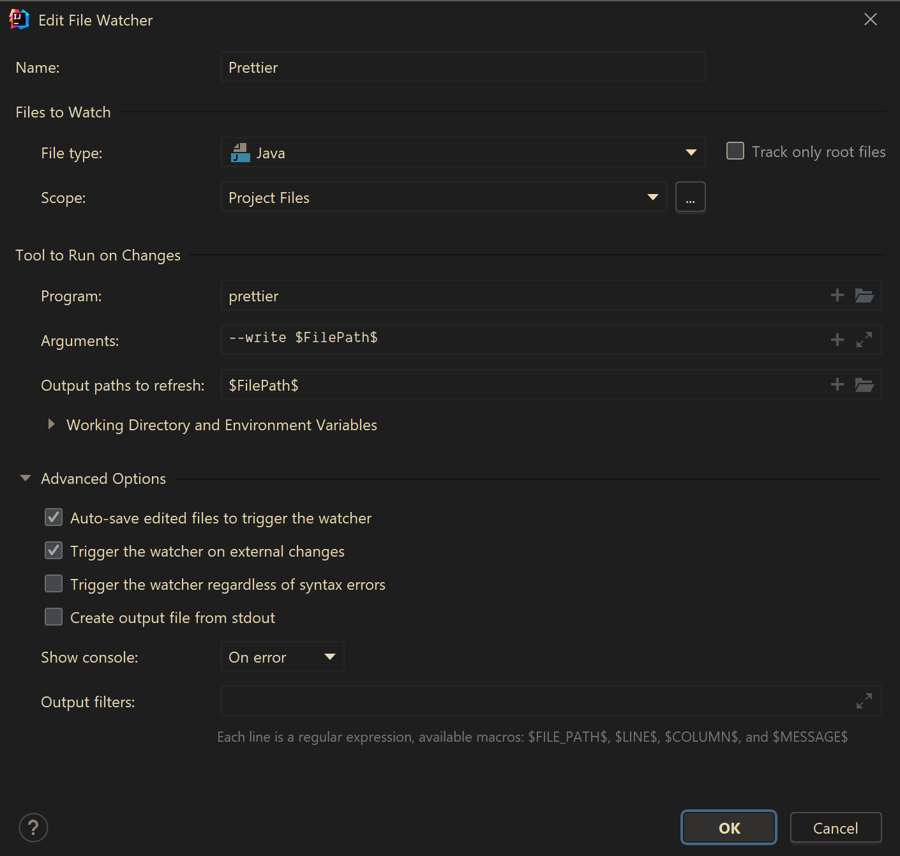

# 🌡 SmartThermostat

Controla la temperatura de tu hogar de manera inteligente

## 💡 Estado actual
```diff
+ [En desarrollo]
```

[Ver tareas pendientes](https://trello.com/b/kkKnKL49/smartthermostat)


## ✏ Herramientas de desarrollo
- Se utiliza Prettier como formateador -> [Prettier for Java](https://github.com/jhipster/prettier-java)
- Se necesita instalar el plugin ``FileWatchers`` en IntelliJ con la siguiente configuración:



## 🚀 Despliegue
- Se necesita crear un .env en la carpeta resources
- Ejecutar ``docker-compose --env-file src/main/resources/.env build``
- Ejecutar ``docker-compose --env-file src/main/resources/.env up``
